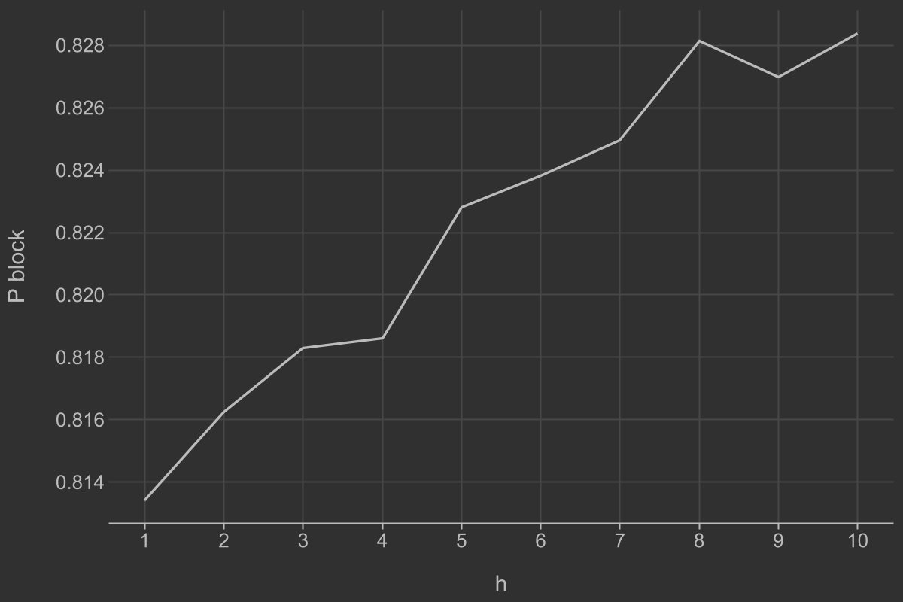
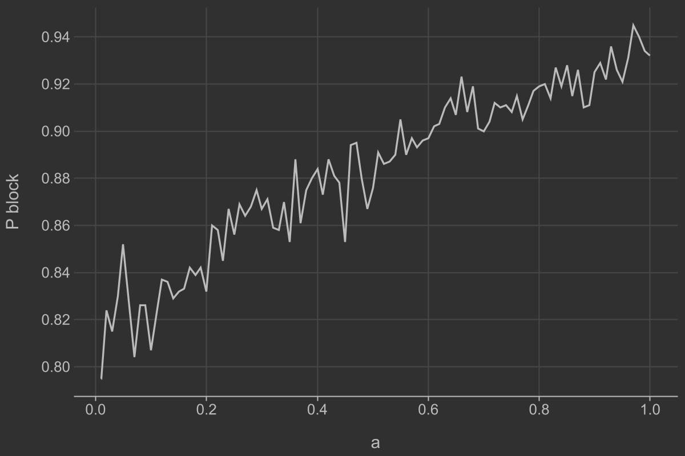
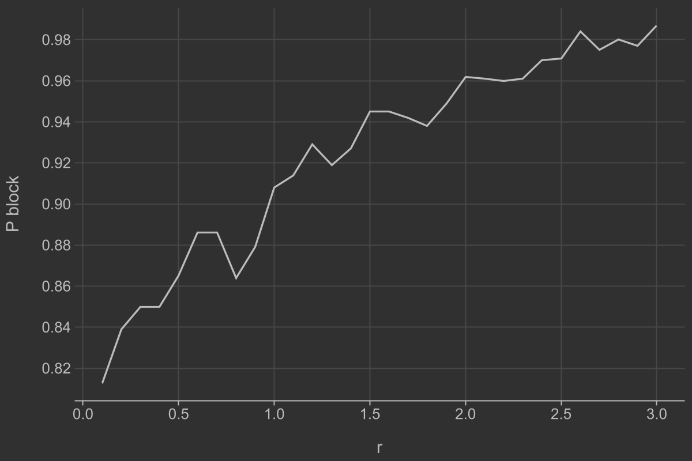
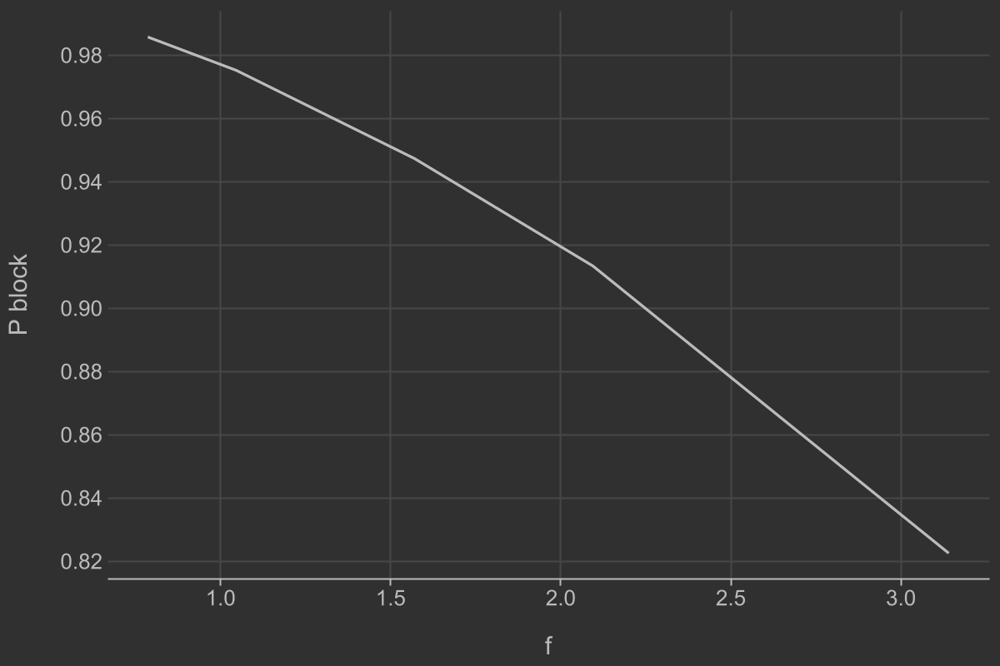
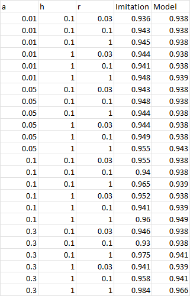

# Мат модель
$P_\text{loss} = 1 - P_\text{visibility}$

$P_\text{visibility} = P_\text{sectors} * P_\text{nonblock}$

$P_\text{sectors} = P_\text{sector}^2$

$P_\text{sector} = \frac{fov}{2\pi}$

$P_\text{nonblock} = e^{-\lambda S}$

$S = 2rh$
# Результаты
## Зависимость от расстояния h

## Зависимость от количества препятствий a

## Зависимость от размера препятствий r

## Зависимость от угла обзора fov

# Сравнение результатов

