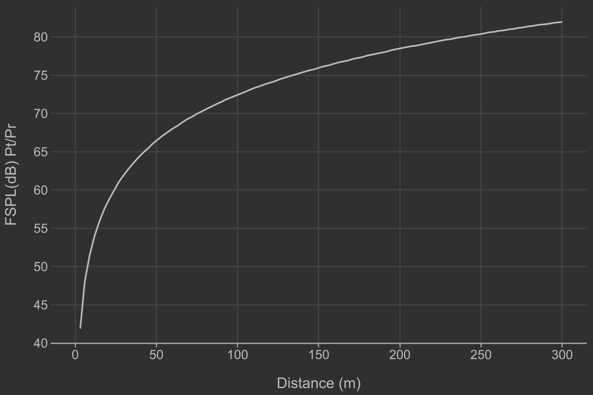
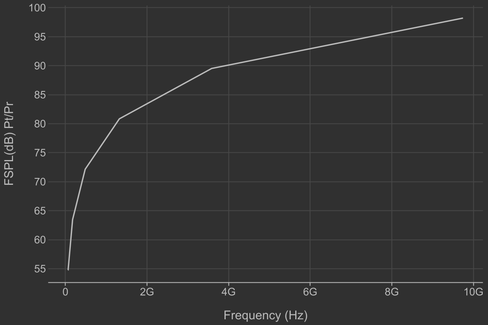
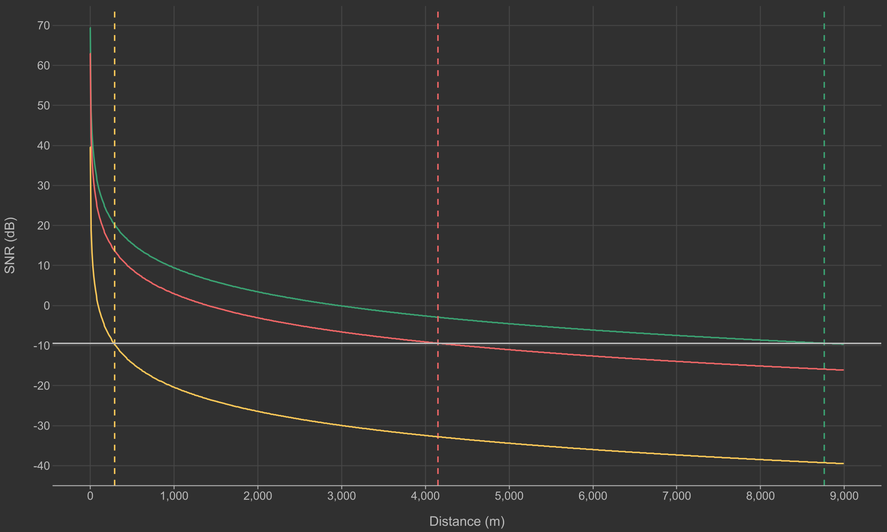

# Модель

$L_{\text{fspl}}(d, f) = 20\log_{10}(d) + 20\log_{10}(f) - 147.55$

$d - \text{расстояние в метрах}$

$f - \text{частота в Гц}$

$SNR(dB)=P_\text{t}+G_\text{t}+G_\text{r}-(L_{\text{fspl}}(d, f)+30)-N$

$P_\text{t} - \text{мощность передатчика в dBm}$

$G_\text{t} - \text{усиление передатчика в dBm}$

$G_\text{r} - \text{усиление приемника в dBm}$

$N - \text{шум в dBm}$

$N = N_0 + 10\log_{10}(B)$

$N_0 - \text{тепловой шум в dBm / Гц}$

$B - \text{ширина канала в Гц}$

# Зависимость от параметров

# Результат модели

$SNR(28GHz) \approx 270m$

$SNR(1.9GHz) \approx 4.2km$

$SNR(900MHz) \approx 8.7km$
