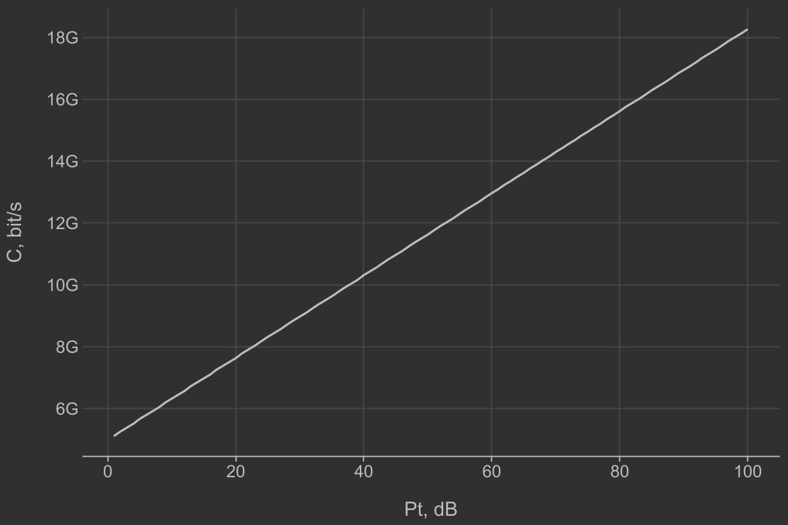

# Практическая работа №5
## Тема
Модели распространения и скорость канала связи

## Задание 1
> Постройте зависимость скорости Шэннона от расстояния для нескольких частот
f = 900 МГц, 1,9 ГГц и 28 ГГц, предположив излучаемую мощность антенны БС 23 дБм,
усиления на передаче и приеме 10 дБм, ширину канала – 400 МГц, тепловой шум −174 дБм/Гц,
модель распространения – FSPL. Проанализируйте полученную зависимость. Почему скорость
ненулевая даже для расстояний, на которых связь невозможна?

 

 

 

Потому что соотношение сигнал-шум уменьшается с расстоянием, но сигнал всегда не равен 
нулю

 
 

$Красный - 28GHz$

$Желтый - 1.9GHz$

$Зеленый - 900MHz$

> Зафиксировав расстояние постройте зависимости от частоты, усиления на передаче,
мощности передачи.
Что происходит в реальных системах связи на этих расстояниях?
За счет чего наиболее эффективно наращивать скорость беспроводных каналов связи?
Что происходит со скоростью если появится интерференция от смежных сот?

В реальных системах на больших расстояниях связь становится плохой.
Наиболее эффективно увеличивать ширину канала передачи.
С появлением интерференции скорость падает.

## Задание 2
> Сравните модель FSPL и модели UMa LOS, UMa NLOS, InH-Office LOS, InH-Office NLOS.
Оцените различия и обоснуйте их (стандарт 3GPP 38.901).

LOS - Line of sight

NLOS - Non line of sight

UMa - Urban Macro
InH-Office - in-hall office

## Задание 3
> Постройте зависимость скорости Шэннона от разных моделей распространения:
FSPL, UMa LOS, UMa NLOS, InH-Office LOS, InH-Office NLOS.
В каких условиях достижимая скорость выше?

## FSPL и UMa

## FSPL и InH-Office

| Цвет        | Модель           |
|-------------|------------------|
| Красный     | FSPL             |
| Фиолетовый  | UMa LOS          |
| Желтый      | UMa NLOS         |
| Зеленый     | InH-Office LOS   |
| Синий       | InH-Office NLOS  |
