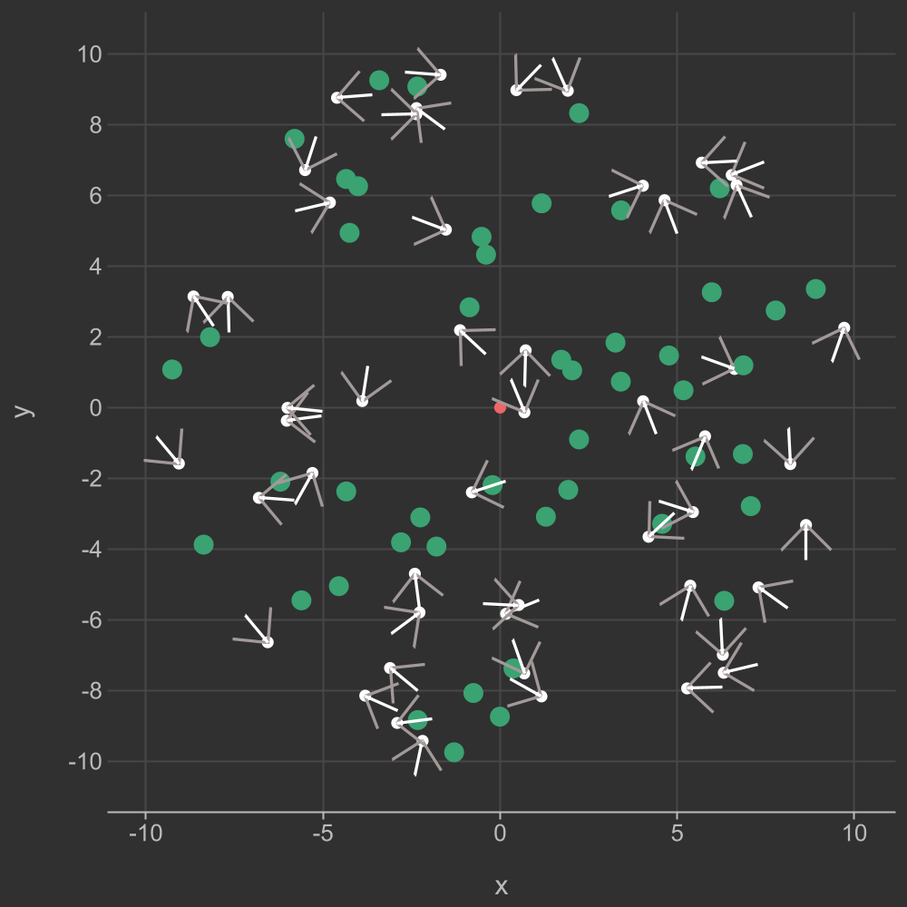
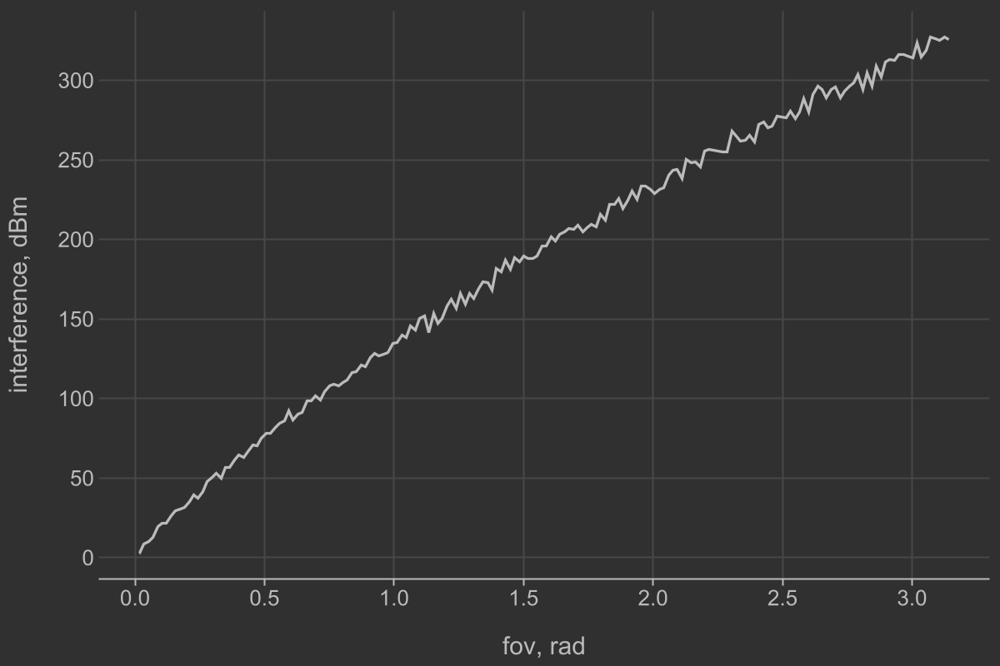
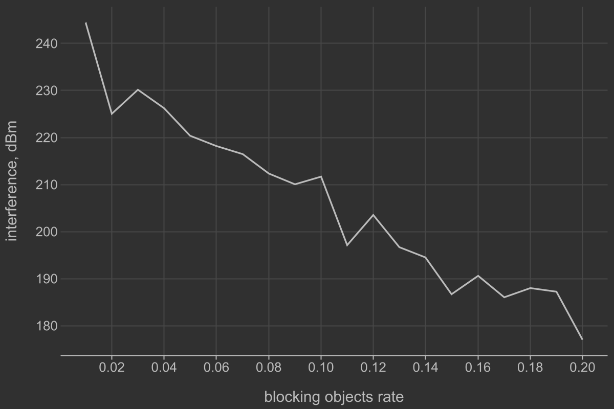

# Практическая работа №6
## Тема
Оценка уровня интерференции на целевом приемнике
с учетом направленных антенн

## Задание 1
> В центре круга радиуса 𝑅 расположен целевой приемник.
> В этом же круге распределены согласно Пуассоновскому равномерному точечному процессу
> с интенсивностью 𝐵 интерферирующие устройства и с интенсивностью 𝐴 – блокирующие объекты
> радиуса 𝐷.

> На целевом приемнике расположена всенаправленная антенна, а интерферирующие устройства
> оборудованы направленными антеннами с углом диаграммы направленности 𝛾. Предполагается,
> что все антенны сориентированы случайным образом и постоянно излучают сигнал с мощностью 𝑃.
> При этом применяется модель распространения сигнала в виде конуса (поправка на коэффициент
> диаграммы направленности).

Для рассчета уровня интерференции на целевом приемнике можно воспользоваться 
FSPL моделью из предыдущих работ. 

$L_{\text{fspl}}(d, f) = 20\log_{10}(d) + 20\log_{10}(f) - 147.55$

$d$ (расстояние) будет зависеть от координат интерферирующих устройств, которые 
генерируются случайно
$f$ (частота) всегда равна 1 ГГц

Для рассчета усиления можно воспользоваться моделью конуса:
$G=\frac{2}{1-\cos(\alpha / 2)}$

Для удобства можно перевести в логарифмическую шкалу:
$G=10 \times \log_{10}(\frac{2}{1-\cos(\alpha / 2)})$

> В случае если сигнал от интерферирующего передатчика до целевого приемника проходит
> через блокирующий объект, то он не создает помех на целевом приемнике.
> Для упрощения интерферирующие устройства не считать блокирующими объектами.
> Аналогично, если целевой приемник не попадает в сектор диаграммы направленности
> интерферирующего передатчика, то соответствующий интерферирующий сигнал тоже
> не создает помех.

 

> Рассчитать уровень интерференции, принимаемый целевым приемником.
> Сделать иллюстрацию, соответствующую расчетному примеру.

 

 

 

Для параметров:

R = 10.0

A = 0.15

B = 0.15

D = 0.1

fov = $\pi$ / 2

Значение интерференции ~= 501

Количество незаблокированных интерферирующих устройств = 9

На графике одной из реализаций модели:

Красная точка - целевой приемник;

Зеленые точки - блокирующие объекты;

Белые точки - интерферирующие устройства 

(белая линия - направление, серые линии - границы области видимости).

## Задание 2
 

 

> На основе полученной модели построить графики среднего значения интерференции
как функции от направленности антенн 𝛾, интенсивности Пуассоновского поля источников
интерферирующих устройств 𝐵, интенсивности Пуассоновского поля блокирующих объектов 𝐴.
При построении графиков использовать как минимум 1000 реализаций.

 

Зависимость уровня интерференции от угла области видимости:

Параметры:

A = 0.05

B = 0.05

Зависимость уровня интерференции от интенсивности генерации интерферирующих устройств:

Параметры:

A = 0.05

fov = $\pi$ / 4

Зависимость уровня интерференции от интенсивности генерации блокирующих устройств:

Параметры:

B = 0.10

fov = $\pi$ / 4
